# Booking Form Comparison: UTHM Student/Staff vs External User

> ✱ = Required field &nbsp;&nbsp; ○ = Optional field

```mermaid
flowchart TD
    START(["User wants to book a lab"])
    START --> SPLIT{ }

    SPLIT --> |"Logged in as\nUTHM Student"| STU_ENTRY
    SPLIT --> |"Logged in as\nUTHM Staff"| STAFF_ENTRY
    SPLIT --> |"Logged in as\nExternal User"| EXT_ENTRY

    %% ─── STUDENT FLOW ────────────────────────────────────────────
    subgraph STU["  UTHM Student  "]
        direction TB

        STU_ENTRY(["Lab public page\n→ Booking modal"])

        STU_ENTRY --> SS1

        subgraph SS1["Step 1 — Applicant Information"]
            direction TB
            SS1A["✱ Full Name"]
            SS1B["✱ Matric ID"]
            SS1C["✱ Email"]
            SS1D["✱ Phone"]
            SS1E["✱ Faculty (dropdown)"]
            SS1F["➕ Add more applicants\n(repeat fields per person)"]
        end

        SS1 --> SS2

        subgraph SS2["Step 2 — Date & Time Slot"]
            direction TB
            SS2A["✱ Date (date picker)"]
            SS2B["✱ Time slot (dynamic\navailability buttons)"]
        end

        SS2 --> SS3

        subgraph SS3["Step 3 — Activity & Supervisor"]
            direction TB
            SS3A["✱ Activity Description"]
            SS3B["✱ Supervisor Name"]
            SS3C["✱ Supervisor Email"]
            SS3D["✱ Supervisor Phone"]
            SS3E["✱ PDF Upload\n(SOP / SWP / SDS, max 8 MB)"]
        end

        SS3 --> STU_SUBMIT(["Submit Booking\nStatus → PENDING"])
    end

    %% ─── STAFF FLOW ──────────────────────────────────────────────
    subgraph STAFF["  UTHM Staff  "]
        direction TB

        STAFF_ENTRY(["Lab public page\n→ Booking modal"])

        STAFF_ENTRY --> SF1

        subgraph SF1["Step 1 — Applicant Information"]
            direction TB
            SF1A["✱ Full Name"]
            SF1B["✱ Staff ID"]
            SF1C["✱ Email"]
            SF1D["✱ Phone"]
            SF1E["✱ Faculty (dropdown)"]
            SF1F["➕ Add more applicants\n(repeat fields per person)"]
        end

        SF1 --> SF2

        subgraph SF2["Step 2 — Date, Time Slot & Documents"]
            direction TB
            SF2A["✱ Date (date picker)"]
            SF2B["✱ Time slot (dynamic\navailability buttons)"]
            SF2C["✱ Activity Description"]
            SF2D["✱ PDF Upload\n(SOP / SWP / SDS, max 8 MB)"]
        end

        SF2 --> STAFF_SUBMIT(["Submit Booking\nStatus → PENDING"])
    end

    %% ─── EXTERNAL FLOW ───────────────────────────────────────────
    subgraph EXT["  External User  "]
        direction TB

        EXT_ENTRY(["External dashboard\n→ New request form\n(single page)"])

        EXT_ENTRY --> E1

        subgraph E1["Organisation & Contact"]
            direction TB
            E1A["✱ Organisation / Institution"]
            E1B["✱ Contact Name (pre-filled)"]
            E1C["✱ Contact Email (pre-filled)"]
            E1D["✱ Contact Phone (pre-filled)"]
            E1E["✱ Participant Count"]
        end

        E1 --> E2

        subgraph E2["Lab & Service Selection"]
            direction TB
            E2A["✱ Select Laboratory (dropdown)"]
            E2B["○ Service Bundle"]
            E2C["○ Equipment (auto-selected\nfrom service)"]
        end

        E2 --> E3

        subgraph E3["Date & Slot"]
            direction TB
            E3A["✱ Preferred Date"]
            E3B["✱ Preferred Time Slot\n(dynamic buttons)"]
        end

        E3 --> E4

        subgraph E4["Purpose & Notes"]
            direction TB
            E4A["✱ Purpose of Use\n(min. 10 characters)"]
            E4B["○ Setup / Equipment Notes"]
        end

        E4 --> EXT_SUBMIT(["Submit Request\nStatus → PENDING PIC APPROVAL"])
    end
```

---

## Key Differences at a Glance

| | UTHM Student | UTHM Staff | External User |
|---|---|---|---|
| **Form structure** | 3-step wizard | 2-step wizard | Single-page form |
| **Entry point** | Public lab page modal | Public lab page modal | Authenticated dashboard |
| **Applicants** | Multiple (dynamic roster) | Multiple (dynamic roster) | Single contact person |
| **ID field** | Matric ID | Staff ID | None |
| **Faculty** | Required | Required | None |
| **Supervisor info** | Required (3 fields) | Not shown (staff are supervisors) | Not applicable |
| **PDF upload** | Required | Required | None |
| **Activity / purpose** | Activity description | Activity description | Purpose of Use (min 10 chars) |
| **Setup notes** | None | None | Optional |
| **Participant count** | Not collected | Not collected | Required |
| **Initial status** | `PENDING` | `PENDING` | `PENDING PIC APPROVAL` |
